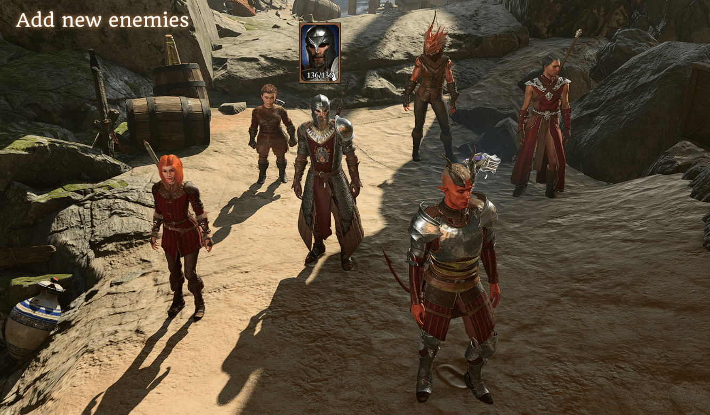

# Combat Extender Clone Feature

### Features:
- Duplicate enemies.
- Add new enemies, or reference (new) templates made by yourself, or from other mods.
- Easy configuration with the .json file you already use.




### Steps:
- Add a new section in your .json configuration named `Clones`
```json
"Clones": {
   "S_WYR_SmugglersCave_StoneLord_Caster_01_7f160186-c30a-40d3-86b6-978df3e72732": {
   "DisplayName": "Fist Polo",
   "Template": "S_WYR_Rivington_FlamingFist_005_abe8c280-a943-4ec0-96ff-0f0caf9ebdfa"
   },
},
```

- We reference the caster and spawn the new enemy nearby. Specifying a template means we only use
the caster for the position, as all stats, passives and equipment are taken from the template.
- DisplayName is optional, else we take the name from the template


You can get guids by running `_D(Mods.CombatExtender.GetNearbyCharacters(10))` in the script extender console.

```json
[
        {
                "Distance" : 0.0,
                "Entity" : "Entity (02400001000163ad)",
                "Guid" : "668689c9-b080-8bbe-422b-17c10ebc5144",
                "Handle" : "Jen",
                "Name" : "HalfElves_Female_High_Player_Dev"
        },
        {
                "Distance" : 1.709204043874706,
                "Entity" : "Entity (0240000200007c9d)",
                "Guid" : "162d06c8-b858-db47-245b-6d2a125c9534",
                "Handle" : "Invoker of Bhaal Kaelar Dusaan",
                "Name" : "Humans_Male_Cultist_Bhaal_Invoker"
        },
        {
                "Distance" : 2.0024243132915851,
                "Entity" : "Entity (02400001000163ff)",
                "Guid" : "58a69333-40bf-8358-1d17-fff240d7fb12",
                "Handle" : "Lae'zel",
                "Name" : "S_Player_Laezel"
        },
        {
                "Distance" : 2.3376913569354207,
                "Entity" : "Entity (02400001000163a1)",
                "Guid" : "3ed74f06-3c60-42dc-83f6-f034cb47c679",
                "Handle" : "Shadowheart",
                "Name" : "S_Player_ShadowHeart"
        },
        {
                "Distance" : 3.09470136556362,
                "Entity" : "Entity (0240000200007c9e)",
                "Guid" : "1b82c291-6ce2-48c9-8b83-f07418f73939",
                "Handle" : "Gazz",
                "Name" : "S_LOW_MinscHideout_Doppelganger_01"
        },
        {
                "Distance" : 3.4057667305013908,
                "Entity" : "Entity (0240000100017bce)",
                "Guid" : "33cbe340-14fc-4dec-9b14-e84b8a1413e0",
                "Handle" : "Vutt",
                "Name" : "S_LOW_MinscHideout_Doppelganger_02"
        },
```

- 10 is the radius from the character you are current controlling.
- You can use the guid directly `abe8c280-a943-4ec0-96ff-0f0caf9ebdfa` or you can use the more readable format: `S_WYR_Rivington_FlamingFist_005_abe8c280-a943-4ec0-96ff-0f0caf9ebdfa`. The second one is created by combining "Name" underscore (_) "Guid"


For questions here's the [Combat Extender thread on the Official Larian Discord](https://discord.com/channels/98922182746329088/1186718074875957298), you can also use the posts section of Nexus Mods.
