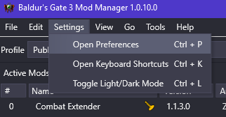
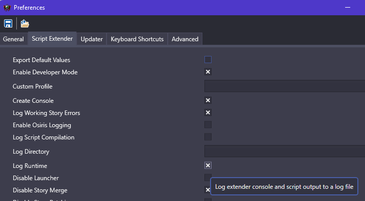
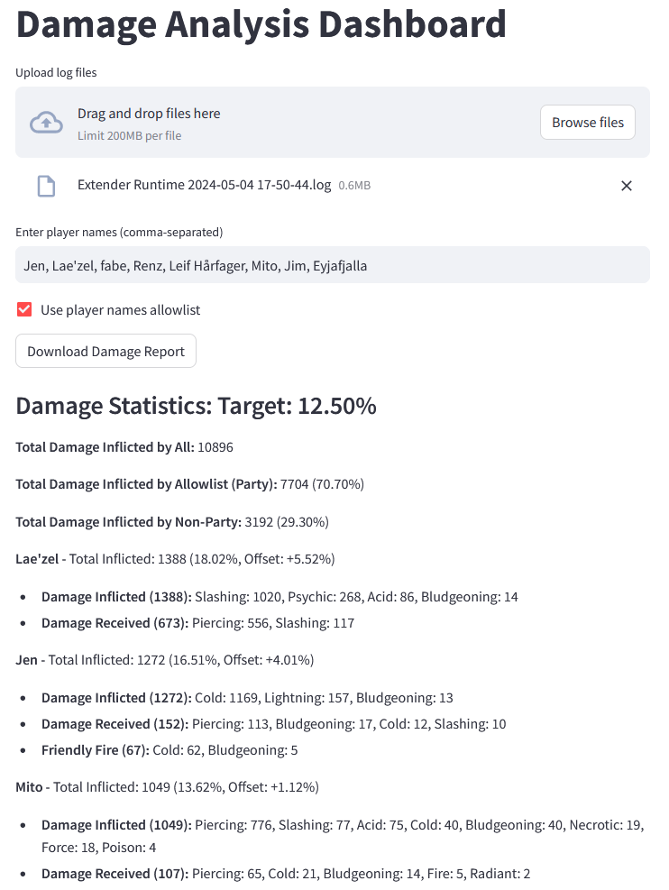

# Combat Extender Damage Analysis

### Steps:
1. Follow setup guide: https://github.com/Zehtukae/combat-extender/blob/main/guide.md
2. Open Preferences in BG3MM

3. Enable `Log Runtime`

3. If you also enable `Create Console` you can see the live log.
4. Logs will appear in `%localappdata%\Larian Studios\Baldur's Gate 3\Script Extender Logs` (Use WINKEY + R, then paste)
5. Play the game!
6. Upload one, or many session logs to the [damage analysis web application](https://bg3dmg.streamlit.app/)

The picture below is an example of multiple files

7. Done! For questions here's the [Combat Extender thread on the Official Larian Discord](https://discord.com/channels/98922182746329088/1186718074875957298), you can also use the posts section of Nexus Mods.
