# Combat Extender Setup Guide

### Steps:
1. Download from Nexus Mods: https://www.nexusmods.com/baldursgate3/mods/5207
2. Extract the .zip file

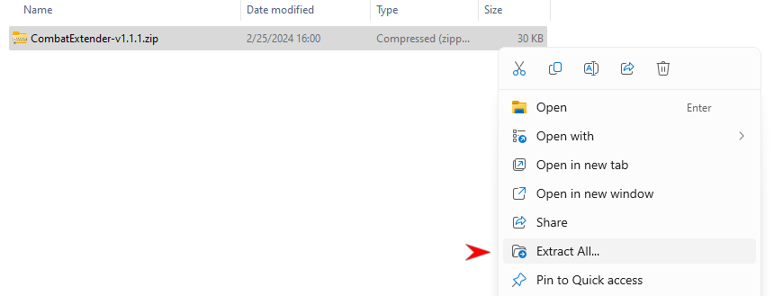

Highlighted is the mod file: `CombatExtender.pak`

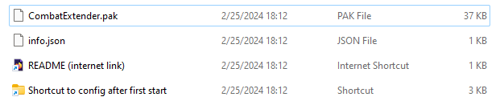

3. If you already have BG3MM and Script Extender installed, jump to step 9.
4. Install and run [LaughingLeader's Baldur's Gate 3 Mod Manager (BG3MM)](https://github.com/LaughingLeader/BG3ModManager/releases/download/1.0.10.0/BG3ModManager_Latest.zip)

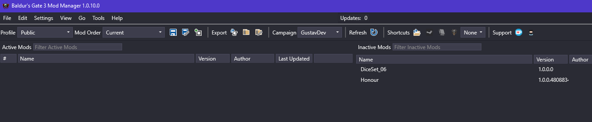

5. Install Script Extender if you do not have it yet, this mod requires it.

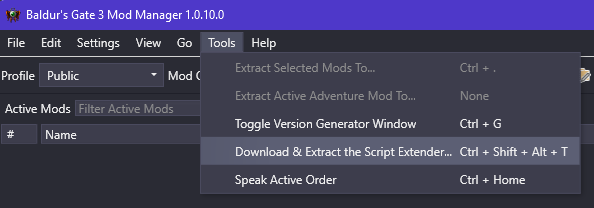

6. Navigate to the mods folder

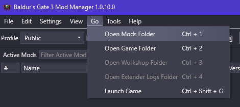

7. Move `CombatExtender.pak` here. Result should be as shown below.

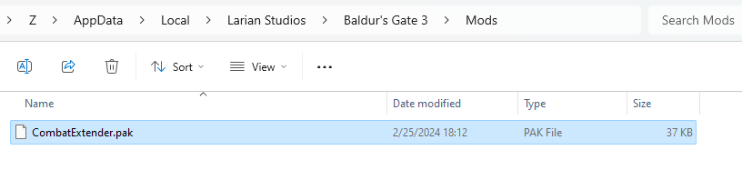

8. Return to BG3MM, click the refresh button

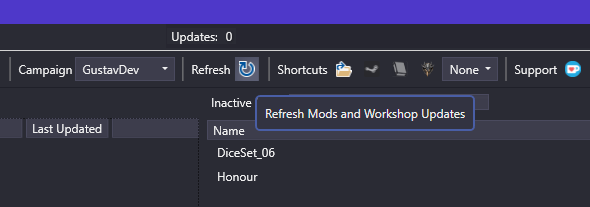

The mod will now be visible on the left hand side.

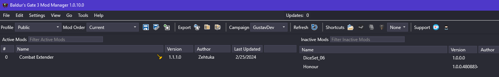

9. Save the mod loader configuration.

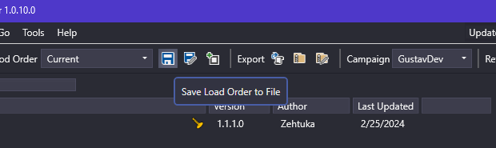

10. Launch the game using the BG3 icon.

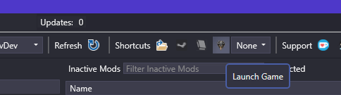

11. Load your existing save file, when you can control your character continue with the next step.
12. Return to the folder from step 2 and click the shortcut.

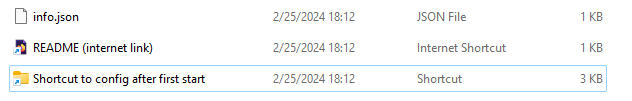

13. This is the Script Extender folder which contains the configuration file `CombatExtender.json`.

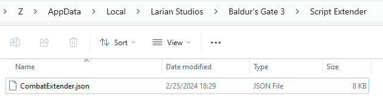

14. You can edit your configuration in a browser using [Visual Studio Code](https://vscode.dev/)

NOTE: You can only save the file directly using Chrome or Edge. Firefox will download the file for you.

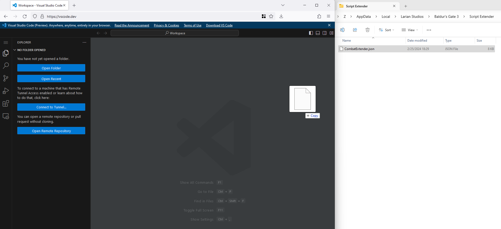

15. The file is in a JSON format. Visual Studio Code will inform you about errors.

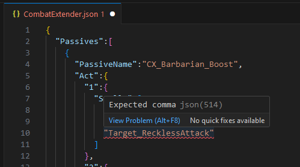

16. [Here is an easier to use version of the default configuration](Source/CombatExtender.json). You can replace `CombatExtender.json` with this file.